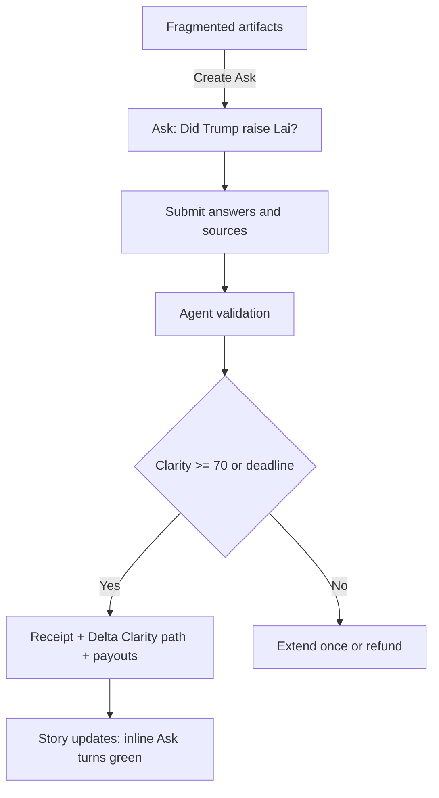
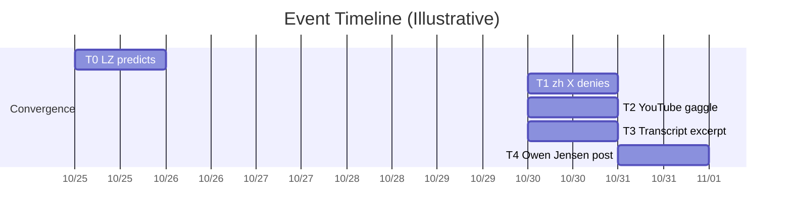
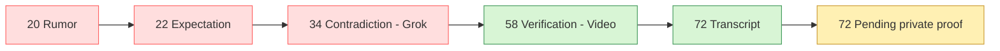
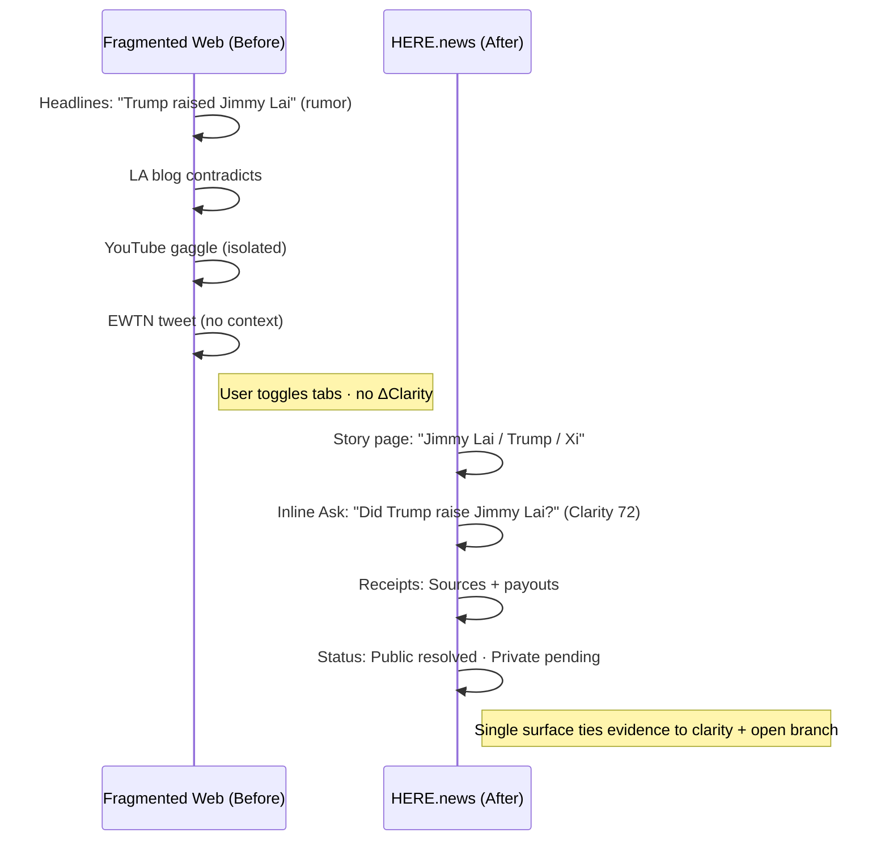

# Case Study — Trump–Jimmy Lai: From Fragmentation to Coherence

Last Updated: 2025-11-04 (UTC)
Status: Draft (for whitepaper inclusion)
Owner: Product/Eng

Purpose
- Present a concrete, high-signal incident where the information ecosystem fragmented, and show how the HERE.news recursive journalism model resolves it. This section is designed to be dropped into the whitepaper and used in demos.

Scope & Notes
- Real-world window: late Oct 2025. Artifacts include social posts, Lianhe Zaobao coverage (zh), EWTN reporting citing a White House official, a Forbes video clip, and a transcript excerpt provided in this repo. We treat these as artifacts to be evaluated, not as adjudicated truth. Resolution statements are explicitly scoped (e.g., on-camera segment vs. private meeting) to avoid overclaiming.

---

## 1) The Smoking Gun

Claim in the wild (competing narratives)
- Narrative A: “Donald Trump raised Jimmy Lai’s case with Xi Jinping.”
- Narrative B: “No mention; outlets or posts overreached.”

Observed conditions
- High virality, multi-lingual coverage, time-staggered artifacts, partial clips, ambiguous sourcing.
- Result: Millions believed different versions of the same event.

Artifacts (illustrative)
- [S1] Lianhe Zaobao article (zh) predicting Trump will raise Jimmy Lai (senators push).
- [S2] Chinese-language X posts denying the mention and mocking reports.
- [S3] Full press gaggle video (YouTube) after the Trump–Xi meeting; on-camera segment transcript excerpt reviewed.
- [S4] Transcript excerpt file (derived from S3, public on-camera segment).
- [S5] X post by Owen Jensen (EWTN) claiming White House official confirmation that Trump raised Jimmy Lai.
- [S6] Journalist wrap-up raising the mention question (placeholder until canonical link is selected).

Notes
- For [S4], see transcript excerpt stored at [artifacts/TRANSCRIPT_TRUMP_GAGGLE_EXCERPT.md](artifacts/TRANSCRIPT_TRUMP_GAGGLE_EXCERPT.md) (auto-generated captions; reviewer cross-read). Public, on-camera segment only.

---

## 2) Systemic Breakdown: Why the Truth Collapsed

| Failure | Description | Consequence |
| --- | --- | --- |
| Fragmented verification | Outlets verify independently; no shared provenance graph | Contradictions persist across languages/geographies |
| Virality > clarity | Platforms reward speed and engagement | Rumors consolidate before evidence converges |
| Opaque sourcing | Readers can’t trace claims to artifacts | Proof fatigue → apathy or polarization |
| Misaligned incentives | Outrage monetizes better than correction | Late truth arrives quiet and under-incentivized |
| AI auto-summaries | Grok automated reply repeats unsourced claim as fact | False authority reinforces misinformation |

**AI involvement callout**
- Grok’s auto-generated note reiterated the unsourced claim (“Trump didn’t raise Lai”) as if verified, despite no supporting evidence. In the HERE.news stack, the agentic validator downranks such unsourced AI assertions and flags them for human review, preventing automated hallucinations from hijacking the race.

---

## 3) Reconstruction: How Recursive Journalism Restores Coherence

Anchor Ask (ID sketch `ask_312`)
- Prompt: “Did Donald Trump raise Jimmy Lai’s case with Xi Jinping during their Oct 2025 meeting?”
- Scope: Entities — Donald Trump (Q22686), Xi Jinping (Q57469), Jimmy Lai (Q170910), Story “US–China 2025 Meetings”.
- Policy: credits-only bounty; invite-only answers; resolution at Clarity ≥ 70 or deadline (see TRUTH_MARKET_RFC.md).

Evidence linking (examples)
- Primary: transcript excerpt (verbatim public remarks), video clip(s).
- Secondary: EWTN/Owen Jensen post (WH official claim), Lianhe Zaobao article (zh), other reputable outlets.

Agent checks (MVP)
- Source reachability; claim extraction; entity linking; contradiction detection (“Jimmy Lai” token absence in transcript segment); duplication vs existing graph; modality tagging.

Flow

---

## 4) ΔClarity Trajectory: The Truth Race in Motion

Corrected event timeline (with clarity notes)
- T0 2025-10-25 06:14 UTC (14:14 SGT) — Lianhe Zaobao predicts Trump will raise Jimmy Lai under Senate pressure [S1]. Sets expectation; clarity low pending evidence.
- T1 2025-10-30 15:04 UTC (11:04 EDT) — MichaelHXHX X post denies any mention, mocking reports; Grok auto-reply at 2025-10-31 01:14 UTC repeats the denial as fact despite zero evidence [S2]. Creates contradictory branch with apparent automated authority but no sourcing.
- T2 2025-10-30 (YouTube publish timestamp) — Full press gaggle video shows no public reference to Lai [S3]. Raises clarity for the public segment by providing primary footage.
- T3 2025-10-30 (transcript extraction window) — Transcript derived from the same gaggle confirms no mention on camera [S4]. Adds minor reinforcement and searchable text for validation.
- T4 2025-10-31 01:11 UTC (21:11 EDT previous day) — Owen Jensen posts that a WH official confirmed Trump did mention Lai [S5]. Re-opens unresolved branch covering any private portion of the meeting.

Visualization

ΔClarity curve (illustrative)

Before vs After (UX snapshot)

Scope-guarded resolution options (examples)
- Public on-camera segment: “No direct mention of ‘Jimmy Lai’ found in the on-camera transcript.”
- Meeting overall: “Insufficient evidence to confirm/deny private-portion mention; Ask remains scoped to public remarks unless further artifacts emerge.”

---

## 5) Receipt (Resolution Record — MVP Mock)

Header (current state)
- Ask: Did Trump raise Jimmy Lai with Xi?
- Scope: Story US–China 2025 • Entities: Trump, Xi, Lai
- Status: Public segment resolved, private segment pending
- Last updated: 2025-10-31 • Public clarity: 72/100 • Bounty: 60 credits • Followers: 24

ΔClarity notes (scope-aware)
- Public on-camera segment: strengthened by T2 and T3 (no mention observed).
- Whole meeting (public + private): re-opened by T4 claim; awaits corroboration. Treat as unresolved until additional artifacts emerge.

Sources (IDs)
- S1 Lianhe Zaobao (zh) — https://www.zaobao.com.sg/realtime/china/story20251025-7716503 (2025-10-25 14:14 SGT / 06:14 UTC)
- S2 Chinese-language X posts (zh) — https://x.com/MichaelHXHX/status/1983912860645527656 (related: https://x.com/MichaelHXHX/status/1984126848343928843) · 2025-10-30 11:04
- S3 Full press gaggle video (YouTube) — https://www.youtube.com/watch?v=g6GfiUnj5jE&t=243s
- S4 Transcript excerpt file (public on-camera segment) — [artifacts/TRANSCRIPT_TRUMP_GAGGLE_EXCERPT.md](artifacts/TRANSCRIPT_TRUMP_GAGGLE_EXCERPT.md)
- S5 Owen Jensen (EWTN) X post claiming WH official confirmation — https://x.com/owentjensen/status/1984065694896378145

Illustrative ΔH contributions (public segment)
- Builder A — Video ingestion & ΔH measurement (YouTube → clarity engine): +18 clarity → ~24 credits (~40%)
- Builder B — Transcript extraction & claim alignment: +14 clarity → ~19 credits (~32%)
- Builder C — Contradiction audit (flag Grok + MichaelHXHX misinformation): +6 clarity → ~9 credits (~15%)
- Builder D — Expectation context (link LZ prediction to Ask): +5 clarity → ~8 credits (~13%)

Resolution note
- Statement applies to public on-camera remarks during the referenced window. Additional artifacts may update scope. Auto captions reviewed; prefer official transcript when available.

Tempo summary (UTC)
- 2025-10-25 06:14 — Expectation narrative pre-loads the market without direct evidence (S1).
- 2025-10-30 15:04 — Contradiction thread (S2) dominates discourse hours before primary material lands; Grok reiteration at 01:14 next day lends false automated certainty to the unsourced claim.
- 2025-10-30 evening (YouTube publish) — Primary video (S3) and transcript (S4) enter the graph almost simultaneously, lifting public-segment clarity and allowing receipts to attribute ΔH precisely.
- 2025-10-31 01:11 — Private-portion claim (S5) surfaces, keeping the overall Ask open while the system marks the on-camera segment resolved, showing stakeholders exactly which part of the narrative remains unverified.
- Present — No confirmed artifact resolves the closed-door conversation; bounty remains live. The unresolved branch is the value proposition: the market pays for future truth to emerge, not just for retroactive fact-checking.

Policy “so what”
- In high-stakes diplomacy, even a 12-hour rumor gap can shape markets and geopolitics. Recursive journalism compresses that gap to minutes by rewarding verifiable clarity over viral noise, giving policymakers and investors a shared, auditable ground truth.

Economics & Engagement Levers (single-race scope)
- Revenue hooks: sponsor the Lai Ask bounty; upsell a “private-portion watchlist” for S5 followers; brand a “Correct the AI” challenge where credit rewards come from partners when Grok-like errors are flagged.
- Retention loops: issue badges/η-dividends to the 24 followers; automate re-engagement pings (“New activity on the Lai race”) tied to S5 updates or new evidence submissions.
- Product proof: use receipts + timeline as live demo collateral; benchmark ΔClarity vs. expert verdicts to validate the coherence engine; export the sequence as a compact case study for civic partners.
- Governance capital: graduate the builders who ingested/transcribed evidence into “verified responders” for future diplomacy Asks; package receipts for NGOs lobbying on Lai’s behalf.

UX outcomes
- Inline Ask on story turns green upon resolution; one-click receipt shows sources and Δ path. Opposing views remain visible via claims pane; provenance is first-class.

---

## 7) Reproducing the Case (MVP Data Entry Plan)

1) Create Ask with scope chips (Story: US–China 2025; Entities: Trump, Xi, Lai) and a 3–7 day deadline.
2) Add artifacts as evidence; run extraction (claims, entities, modalities). Mark transcript excerpt as Primary.
3) Submit two builder answers: (a) transcript search + quote alignment; (b) clip matching + multilingual scan summary.
4) Let agent validation run (reachability, dupes, contradiction flags). Monitor ΔClarity preview.
5) Resolve at threshold or deadline; generate receipt; update story pane and publish demo link.

Notes
- Keep resolution statements scoped (public vs private portions) to avoid overreach. Capture uncertainty explicitly when evidence is partial.

---

## 8) Why This Matters (Meta)

Traditional vs Recursive
- Publish→react vs Evolve→converge. Compete for traffic vs Compete for clarity. Readers consume vs Readers participate. Truth static vs Truth iterative. No provenance vs Every claim traceable.

Tagline (whitepaper-ready)
- “The Jimmy Lai episode was not a scandal of politics — it was a scandal of information entropy. Recursive journalism turns chaos into coherence by making truth a collaborative, rewarded computation.”
